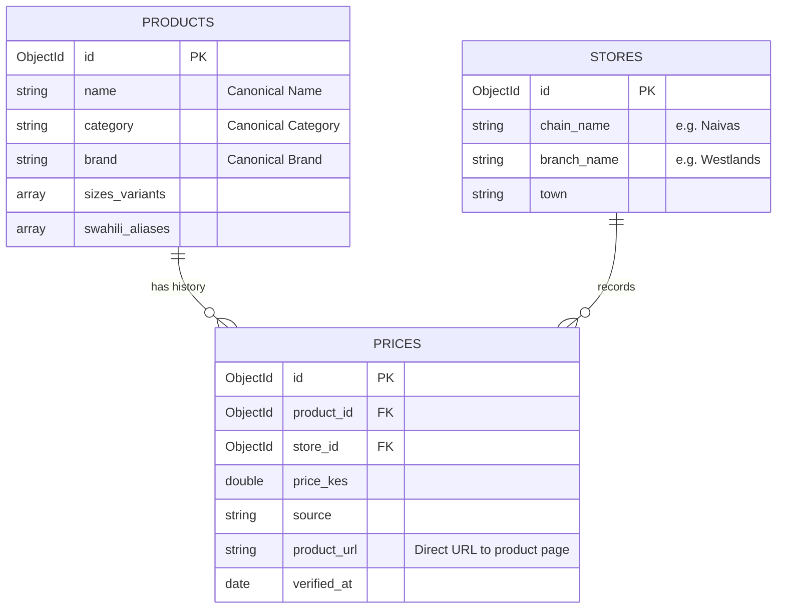

# Product Standardization and Data Consistency Architecture

This document describes how we achieve data consistency across different target supermarket websites and store all scraped items in a single unified schema (Products, Stores, and Prices).

---

## 1. The Challenge of Inconsistent Data
Different supermarkets list products with different naming conventions, categorization schemes, and formatting:

* **Naivas Online**: `Broadways White Bread - 400g` (Category: `Bakery`)
* **Carrefour**: `BROADWAYS BREAD WHITE 400G` (Category: `Bread & Cake`)
* **Quickmart**: `Broadways Bread White 400 g` (Category: `Fresh Bakery`)

If stored raw, these would create duplicate products, preventing users from comparing prices.

---

## 2. Unified Database Schema Model

To maintain consistency, we enforce a **Normalized Database Schema** consisting of three distinct collections:



---

## 3. The Standardization Pipeline (ETL)

To resolve data variance, we pass scraped items through a custom **Standardization Pipeline** inside Scrapy before writing to MongoDB.

```text
[Raw Scraper Output] 
      │
      ▼
[Cleaning Step] ──► Strip whitespace, extract float prices, clean currency (KES).
      │
      ▼
[Parsing Step]  ──► Extract Brand and Size (e.g., "400g", "1L") via Regex.
      │
      ▼
[Matching Step] ──► Map raw product to Canonical Product ID (fuzzy/embedding search).
      │
      ▼
[Category Map]  ──► Translate raw categories to canonical PricePoa categories.
      │
      ▼
[Bulk Insert]   ──► Save standardized document to prices/products collections.
```

---

## 4. Implementation Steps

### Step A: Dynamic Brand & Size Parser
We parse out the brand and package size from the scraped product titles to extract matching attributes:

```python
import re
from typing import Tuple, Optional

def parse_product_attributes(raw_title: str) -> Tuple[str, Optional[str], Optional[str]]:
    """
    Standardize product title and extract brand and size variants.
    Example: "Broadways White Bread - 400g" -> ("White Bread", "Broadways", "400g")
    """
    # 1. Normalize case and spaces
    title = re.sub(r'\s+', ' ', raw_title).strip()
    
    # 2. Extract Size (e.g., 400g, 500ml, 1 L, 2 Litres)
    size_pattern = r'(\d+(?:\.\d+)?\s*(?:g|kg|ml|l|litre|litres|pcs|packs))\b'
    size_match = re.search(size_pattern, title, re.IGNORECASE)
    size = size_match.group(1).replace(" ", "").lower() if size_match else None
    
    # Remove size from title
    if size_match:
        title = title.replace(size_match.group(0), "")
        
    # 3. Match Brand against list of known brands (e.g., Broadways, Bidco, Brookside)
    known_brands = ["broadways", "bidco", "brookside", "tuskeys", "naivas", "carrefour"]
    brand = None
    for b in known_brands:
        if re.search(r'\b' + b + r'\b', title, re.IGNORECASE):
            brand = b.capitalize()
            title = re.sub(r'\b' + b + r'\b', "", title, flags=re.IGNORECASE)
            break
            
    # Clean up residual punctuation and return clean title
    clean_title = re.sub(r'[-\s,]+$', '', re.sub(r'^[-\s,]+', '', title)).strip()
    return clean_title, brand, size
```

---

### Step B: The Canonical Product Matching Algorithm
To avoid duplicate products, the pipeline matches the cleaned product properties to an existing database record:

```python
from database.connection import get_database

async def get_or_create_canonical_product(clean_name: str, brand: Optional[str], size: Optional[str], category: str) -> str:
    """
    Looks up a product in the database by checking name, brand, and size similarity.
    Creates a new product if none exists.
    """
    db = await get_database()
    
    # 1. Direct query lookup
    query = {"name": {"$regex": f"^{re.escape(clean_name)}$", "$options": "i"}}
    if brand:
        query["brand"] = brand
        
    existing_product = await db.products.find_one(query)
    
    if existing_product:
        # Check if the size variant is already listed
        if size and size not in existing_product.get("sizes_variants", []):
            await db.products.update_one(
                {"_id": existing_product["_id"]},
                {"$addToSet": {"sizes_variants": size}}
            )
        return str(existing_product["_id"])
        
    # 2. If not found, create a new canonical product
    new_product = {
        "name": clean_name,
        "category": category,
        "brand": brand,
        "sizes_variants": [size] if size else [],
        "swahili_aliases": [],
        "sheng_aliases": []
    }
    result = await db.products.insert_one(new_product)
    return str(result.inserted_id)
```

---

### Step C: Unified Category Mapping
We define a dictionary in `settings.py` or inside MongoDB to map inconsistent supermarket categories to our unified taxonomy:

```python
CATEGORY_MAPPING = {
    # Fruit and Veg
    'fruit & veg': 'Fruits & Vegetables',
    'fresh foods': 'Fruits & Vegetables',
    'groceries': 'Fruits & Vegetables',
    
    # Bakery
    'bakery & bread': 'Bakery',
    'bread & cake': 'Bakery',
    'fresh bakery': 'Bakery',
    
    # Dairy
    'dairy & eggs': 'Dairy & Eggs',
    'milk & dairy': 'Dairy & Eggs',
}

def get_canonical_category(raw_category: str) -> str:
    category_lower = raw_category.lower().strip()
    return CATEGORY_MAPPING.get(category_lower, "General")
```

---

### Step D: Product Link Persistence

Because the canonical `product` is shared across all stores, while each store has its own unique product link, we store the product link in two locations for maximum utility:

#### 1. In the `prices` Collection (Transactional Link)
Every price record contains the direct URL it was scraped from. This is crucial for auditing, debugging, and rendering a "buy now" link matching the current price:
```python
price_doc = {
    'product_id': canonical_product_id,
    'store_id': store_id,
    'price_kes': price,
    'source': 'naivas_online',
    'product_url': response.url,  # Direct link stored here
    'verified_at': datetime.utcnow()
}
```

#### 2. In the `products` Collection (Canonical Store-Link Dictionary)
To allow the frontend to easily fetch the active links for a product across all stores without scanning price history, the matching pipeline maintains a `store_links` dictionary on the canonical product document:
```python
# Add link mapping to Products collection during matching
await db.products.update_one(
    {"_id": ObjectId(canonical_product_id)},
    {"$set": {f"store_links.{store_id}": response.url}}
)
```
This produces a unified `products` document structured like this:
```json
{
  "_id": ObjectId("60f7b3b5d8f1a434e8a6b5c1"),
  "name": "White Bread",
  "brand": "Broadways",
  "sizes_variants": ["400g"],
  "store_links": {
    "60f7b3b5d8f1a434e8a6b5c2": "https://naivas.online/product/broadways-white-bread-400g",
    "60f7b3b5d8f1a434e8a6b5c5": "https://www.carrefour.ke/product/broadways-bread-white"
  }
}
```
