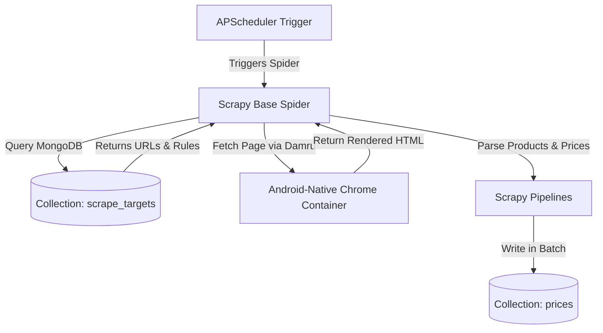

# Dynamic Target Loading and MongoDB Persistence Architecture

This document describes how we design the scheduler and data pipeline to load target scrape URLs dynamically from MongoDB and write back fresh product/price data at scheduled intervals.

---

## 1. Current vs. Proposed Architecture

### Current Implementation
* **Loading Targets**: Spiders (e.g., `naivas_spider.py`) hardcode their root target entry points in `start_urls` (e.g., `['https://naivas.online/supermarket']`). 
* **Scheduling**: Managed by `scheduler.py` via `APScheduler` (`BackgroundScheduler`) which starts the Scrapy crawl thread (`CrawlerProcess.crawl()`) at specific staggered times (like 2:00 AM, 2:15 AM).
* **Persistence**: Product and price items are extracted in spiders and emitted as dictionary items. Scrapy downloader pipeline (`MongoDBPipeline`) gathers these items, buffers them up to a batch size of 100, and flushes them into MongoDB's `prices` collection using bulk upsert operations.

### Proposed Dynamic Integration
To make the scraping target system dynamic, we store target stores, categories, and parameters in a MongoDB collection (e.g. `scrape_targets`) instead of hardcoding them in Python code.

---

## 2. Dynamic Workflow Design



---

## 3. Database Schema for Dynamic Targets

We introduce a new `scrape_targets` collection in MongoDB to define which URLs to crawl.

### Target Schema Definition
```python
from pydantic import BaseModel, Field
from typing import List, Dict, Any, Optional
from datetime import datetime

class ScrapeTarget(BaseModel):
    """Schema representing a dynamic scraping target."""
    store_chain: str = Field(..., description="Store chain name (e.g., Naivas)")
    target_url: str = Field(..., description="The entry point URL to scrape")
    category: str = Field(..., description="Target product category")
    is_active: bool = Field(default=True, description="Enable or disable scraping for this target")
    use_stealth: bool = Field(default=True, description="Whether this target needs Damru Android emulation")
    custom_selectors: Dict[str, str] = Field(
        default_factory=dict, 
        description="Optional overrides for HTML css/xpath selectors (product_name, price, etc.)"
    )
    last_scraped_at: Optional[datetime] = None
    created_at: datetime = Field(default_factory=datetime.utcnow)
```

---

## 4. Coding the Integration

### Step A: Dynamic Spiders
Instead of hardcoding `start_urls`, the spider queries the database to load active targets dynamically during startup:

```python
import scrapy
from ..base_spider import BasePricePoaSpider
from database.connection import get_database

class DynamicPriceSpider(BasePricePoaSpider):
    name = "dynamic_spider"

    def __init__(self, store_chain=None, *args, **kwargs):
        super().__init__(*args, **kwargs)
        self.store_chain = store_chain

    def start_requests(self):
        """Override start_requests to pull entry URLs dynamically from MongoDB."""
        # Use asyncio under Twisted loop to query MongoDB
        loop = asyncio.get_event_loop()
        return loop.run_until_complete(self._load_and_dispatch_targets())

    async def _load_and_dispatch_targets(self):
        db = await get_database()
        
        # Query active targets for this store chain
        query = {"is_active": True}
        if self.store_chain:
            query["store_chain"] = self.store_chain
            
        cursor = db.scrape_targets.find(query)
        targets = await cursor.to_list(length=1000)
        
        requests = []
        for t in targets:
            meta = {
                'category': t['category'],
                'store_chain': t['store_chain'],
                'use_playwright': t.get('use_stealth', False), # Or use_damru
                'custom_selectors': t.get('custom_selectors', {})
            }
            requests.append(
                scrapy.Request(
                    url=t['target_url'],
                    callback=self.parse_category,
                    meta=meta
                )
            )
        return requests
```

---

## 5. Comparison: Current vs. Dynamic

| Dimension | Current Scrapy Playwright Stack | Proposed Dynamic + Damru Stack |
| :--- | :--- | :--- |
| **Target Management** | Static config in Python files. Changing URLs require git pushes and server restarts. | Dynamic. Add, remove, or modify targets via Mongo database updates instantly. |
| **Scheduler Job Control** | Local cron job execution for hardcoded spiders. | The scheduler queries MongoDB to determine which store spiders are active and schedules them staggered. |
| **WAF Bypass Security** | High risk of blocking due to standard headless browser footprint. | Extremely high bypass success using native Android container spoofing (Damru). |
| **Item Deduplication** | Current pipeline groups prices daily to prevent same-day duplicates. | Retains daily deduplication logic, but includes audit logs of raw scraping payloads. |
| **Resource Overhead** | Low (Desktop browser processes are spun up and closed). | Medium-High (Docker containers run in the background; requires managing pool capacity limit). |
